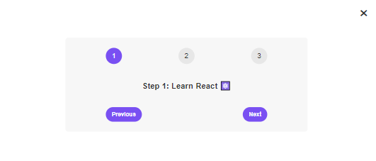

# React Step App

### Descroption

The Step app is a beautifully designed, fully responsive React.js application. Its clean design and smooth transitions ensure an excellent user experience across all devices. Offering a delightful experience with messages and updates at every stage.

### Functionalities

The Step app, Using components, prop drilling, and the useState Hook, the app allows users to navigate through steps while displaying unique messages at each stage. Its clean design and smooth transitions ensure an excellent user experience across all devices.
